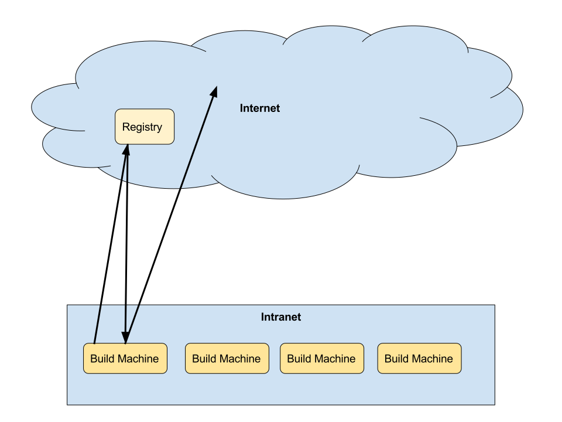
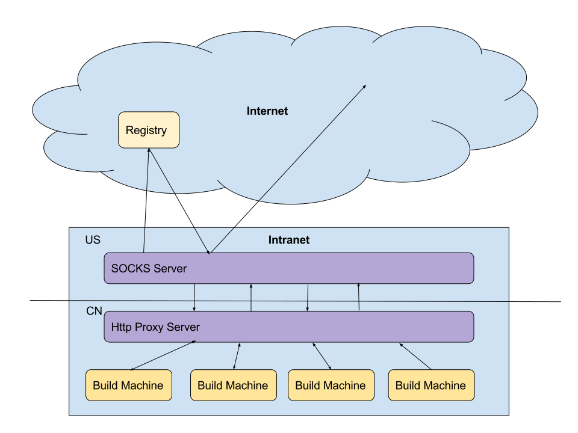

class: middle

# How I keep bower happy BEHIND THE WALL

## Chriest Yu / Chriest YOU

---

## Scenario



---

### Issues

For some mysterious reasons, sometimes resources host on Github are not accessible.
It blocks our build machines.

--

- npm: use Chinese registry like [CNPM](http://cnpmjs.org/)
--

- bower: no public mirror

---

## Solution 1: http proxy



---

### Issues

--

- slow, back-and-forth or even unreachable for local resources
--

- traffic
--

  - Q: why an issue since bower client has cache?
  - A: we use #master for some dev envs

```
// bower.json
{
"dependencies":
  {
    "my-module-A": "https://github.com/owner/repo-a#master",
    "my-module-B": "https://github.com/owner/repo-b#master",
    "my-module-C": "https://github.com/owner/repo-c#master"
  }
}
```

---

## Solution 2: http proxy with cache

### Issues

--

- can not solve the #master branch issue
--

- https cert stuff is annoying

---

class: middle

## So we need something smarter

---

### Before that...

How the whole bower thing works?

---

`bower install xxx`


---

### Resolvers

--
0. find the proper resolver:
https://github.com/bower/bower/blob/master/lib/core/resolverFactory.js#L22-L215

--

  - plugin resolvers
  - github (github.com)
  - git (git://, .git, git@, git+http....)
  - svn (svn, svn+ssh....)
  - url (http, https)
  - local (./, ../,.....)
  - shorthands

--

0. if nothing matches: ask registry then back to step 1
--

0. where & how to get the moudle are up to the resolver
--

  - Find the proper version
--

  - Github Resolver:
      - Archive: Download => Extract => Rename
      - Otherwise: `git clone`
--
  - Url Resolver: Download => Extract => Rename

---

### Registry

--
- how do we get info from registries?
[`registryClient.doRequest`](https://github.com/bower/registry-client/blob/master/lib/lookup.js#L79)

--
- response is an json obj:
e.g: http://bower.herokuapp.com/packages/jquery

---

## Now we can start crafting our solution

### Concerns

--

- **traffic**: less back-and-forth, no world traveling
--

- **transparency**: minimun efforts & effects
--

- **complexity**: easy to setup and maintain

---

## Solution 3: private registry + plugable resolver

--

### Statistic

On bower's official registry:

--

- All packages: 45709
--

- Host on Github: 45589 (99.74%)

--

**If we can solve the Github issue, we win!**

---

### Plugable Resolvers

--

bower provides developers a way to change/enchance the way it handle packages:
[plugable resolvers](http://bower.io/docs/pluggable-resolvers/)
--

  - it should be a CommonJS module
--

  - it should have some methods like `match`, `locate`, `releases`, `fetch`
--

  - in each method, it can either return a value or a promise

---

### Role definitions

--

- **client**: the client who's USING bower, do things like `bower install xxx`
--

- **proxy registry**: a proxy service who help clients getting what they want
--

- **official registry**: the REAL registry that host component information, the official one
is http://bower.herokuapp.com/

---

### Flow


---

### Registry

An express route

--

- On `/packages/:package`:
--

  - lookup from official registry:
```
{
  "name": "jquery",
  "url": "git://github.com/jquery/jquery.git",
  "hits": 14384544
}
```
--
  - if target is on Github, replace url with our own:
```
{
  "name": "jquery",
  //something only our custom resolver recognizes
  "url": "archive://MYHOST/jquery/jquery",
  "hits": 14384544
}
```
--
  - if not, pass the original data to client

---

- On `/:owner/:repo/releases`
--

  - use Github API to get all tags, e.g: https://api.github.com/repos/jquery/jquery/git/refs/tags
--

  - arrange them a little bit
```
{
  "1.0a": "1.0a",
  "0.9.39": "0.9.39"
  //...
}
```
--
- On `/:owner/:repo/archive/:target`:
--

  - use cached version if target hits the cache
--

  - ask github for the archive if not in cache: 'https://github.com/jquery/jquery/archive/3.0.0-alpha1.tar.gz'

---

### Resolver

--

- `match`: return true if source starts with `archive://`
--

- `releases`: ask our registry for this info
--

- `fetch`
  - ask our registry for this
  - extract
  - return tempPath

---

### Efforts

- npm install -g custom-resolver
- .bowerrc

```
{
  "registry": "http://localhost:9919",
  "resolvers": [
    "archive-resolver"
  ]
}
```

--

### Comparison

--

- http proxy & cache
  - we won't affect non-Github packages
--

- [private-bower](https://github.com/Hacklone/private-bower)
  - first hit
  - lite & simple
--

- most important thing: FLEXIBILITY
--

- it's all about balance
--

- **CONS**: Read-only

---

class: middle

# Ultimate solution

--

## Use npm

---

class: middle

# Done, thanks!

This slide & all other slides: http://github.com/jcppman/talks
