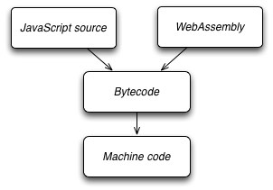

layout: true
class: left, middle
---

# GO FASTER! (And smoother)
---

## After the May lightening talks...
---

## Problems
--

- file size
--

- not PWA-friendly
--

- too many efforts!
    - the web service itself
    - chunks uploading

---

## Let's do it on FE

---

## First thing: Binary data

How do we handle binary data in JS? How about...
--

```
var data = [ 56, 32, 0, 9, 12 ]; // one item per byte
```

--

- Waste of memory (JavaScript Numbers are Always 64-bit Floating Point) 
--

- Waste of computational resource (you can't predict data's structure)

---

## FYI
regular js Array is **dynamic**, and either dense or sparse

---

### Dense
```
// create a dense array
var data = [1, 2, 3, 4, 5];
```

---

### Sparse
```
// create a sparse array
var data = [];
data[666] = 'pretty good';
```

---

## ArrayBuffer

From MDN:
> The ArrayBuffer object is used to represent a generic, fixed-length raw binary data buffer

---

And there's two ways to read/manipulate the data 

--

- TypedArray
--

- DataView 
---

## DEMO

---

## The computation (encoding Mp3)

---

## First approach: SSSG

--

Square-Surface-Stiff-Gang

--

正面硬刚

---

## Problems

- hard
--

- slow

---

## A better approach: SOMW

--

### Steal Old Man's Wheel

--

There's many existing codec encoders, written in C

---

## ASM.JS

> an extraordinarily optimizable, low-level subset of JavaScript

---

```

function f(i) {
    i = i|0;
    return (i + 1)|0;
}

```

---

## JIT vs AOT

---

### JIT


---

### AOT


---

## And then?

---

## Emscripten

> A LLVM backend, compiles LLVM to ASJ.js

---

## LLVM

--

Code --(LLVM frontend)--> IR --(LLVM backend)--> Bytecode

---

### **So any languague who has LLVM frontend could be compiled to javascript**

--

in theory

---

ActionScript, Ada, C#, Common Lisp, Crystal, D, Delphi, Fortran, OpenGL Shading Language, Halide, Haskell, Java bytecode, Julia, Lua, Objective-C, Pony, Python, R, Ruby, Rust, CUDA, Scala, Swift, and Xojo.

---

## Is there something better?

---

## WebAssembly

--

- binary version of asm.js
--

- W3C open standard
--

- supported by browsers natively

---



---

## The ideal way to get .wasm

a compiler for LLVM-WebAssembly compilation

---

## A temporary solution

asm-to-wasm

---

C/C++ => LLVM => ASM.JS => WASM

---

```

var Module = WebAssembly.instantiate(codeBuffer);

// now we can use those methods
Module.exposedMethodA();
Module.exposedMethodB();
// ...

```

---

## One more problem: Blocking

---

## WebWorker

---

```

var worker = new Worker('myWorker.js');

```

---

## But how about all the js single-threaded goodies?

---

- **There's only one way to communicate with workers**
- the variable transfering

## Main

```

worker.postMessage({ name: 'jcppman' });

```

## Worker

```

onmessage = function(a, b, c) {
    // do things
};

```

---

- There's only one way to communicate with workers
- **the variable transfering**

---

## But we need to transfer huge data

---

## Transferable

DEMO

---

## The final demo

DEMO
